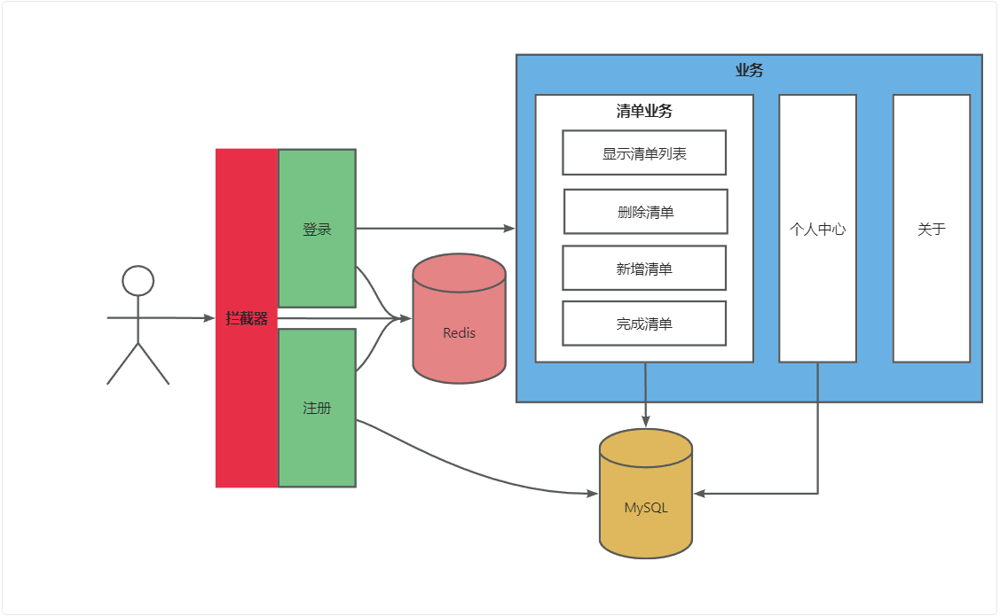
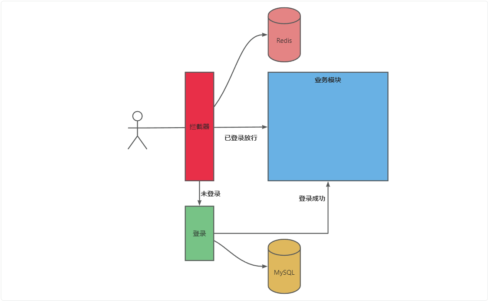

# Inventory

**小小清单**
**介绍：**

小小清单是一个简洁高效的任务管理工具，旨在帮助用户更好地管理日常任务和待办事项。通过清单，用户可以轻松添加、编辑和删除任务、收藏任务，从而提高工作效率和生活质量。我们的目标是提供一个用户友好的平台，帮助每个人更好地组织自己的工作和生活，无论是个人事务还是团队协作，都能轻松应对。

## 成员

组长：仵明雨

组员：孙文乐、李铭伟、马亿博、代宇航、杨士涵

## 项目结构

> ### app：
>
> - **http：路由定义**
> - **service：服务层**
> - **main.go：项目启动入口**
>
> ### domin：实体类
>
> ### repository：持久层
>
> ### static：静态资源
>
> ### templates：页面模板
>
> ### go.mod：模块文件
>
> ### README.md：项目简介

## 架构图

## 功能

### 登录（项目亮点）

#### 1、概述：

使用 Redis + Session，实现的分布式登录系统

#### 2、优点：

- 可实现Session共享，大大提高了项目的可扩展性
- Redis具有极快的读写速度

#### 3、业务逻辑：

- 当用户访问主页面时，校验用户的登录态，如果不存在重定向到登录页面
- 前端将用户填写的表单信息发给后端
- 后端进行用户信息的校验
- 校验成功后，创建session信息，存入redis，重定向到主页面

### 注册

#### 1、概述

**提供用户注册功能，允许新用户创建账户并保存用户信息**

#### 2、业务逻辑

- 用户在注册页面填写注册表单（包括用户名、密码）
- 前端将用户填写的信息发送给后端
- 后端校验表单信息的有效性（如用户名是否已存在、密码强度是否符合要求等）
- 校验成功后，将用户信息存入数据库
- 返回注册成功的响应，前端页面跳转到登录页面

### 用户信息修改

#### 1、概述 

**允许用户修改个人信息，如用户名、邮箱等**

#### 2、业务逻辑

- 用户在个人信息页面修改相应的信息
- 前端将修改后的信息发送给后端
- 后端校验新信息的有效性
- 校验成功后，更新数据库中的用户信息
- 返回修改成功的响应，并更新页面显示

### 显示待办列表

#### 1、概述 

**提供用户查看其待办事项列表的功能**

#### **2、业务逻辑**

- 用户访问待办事项页面
- 前端发送请求获取用户的待办事项列表
- 后端从数据库或缓存中获取该用户的待办事项数据
- 返回待办事项列表数据，前端进行展示

### 添加待办

#### 1、概述

**允许用户添加新的待办事项**

#### **2、业务逻辑**

- 用户在待办事项页面输入新的待办事项信息
- 前端将新待办事项信息发送给后端
- 后端接收信息并存入数据库
- 返回添加成功的响应，并更新待办事项列表显示

### 删除待办

#### 1、概述 

**允许用户删除不再需要的待办事项**

#### **2、业务逻辑**

- 用户在待办事项页面选择要删除的待办事项
- 前端发送删除请求，并附带要删除待办事项的 ID
- 后端接收请求后，从数据库中删除该待办事项
- 返回删除成功的响应，并更新待办事项列表显示

### 添加收藏待办
#### 1、概述
**提供用户将待办事项添加到收藏列表的功能，使用户可以标记重要或常用的待办事项。**
#### 2、业务逻辑

- 用户在待办事项页面选择要收藏的待办事项
- 前端发送收藏请求，并附带要收藏待办事项的 ID
- 后端接收请求后，在数据库中更新该待办事项的收藏状态
- 返回收藏成功的响应，并更新待办事项列表显示，显示收藏标识